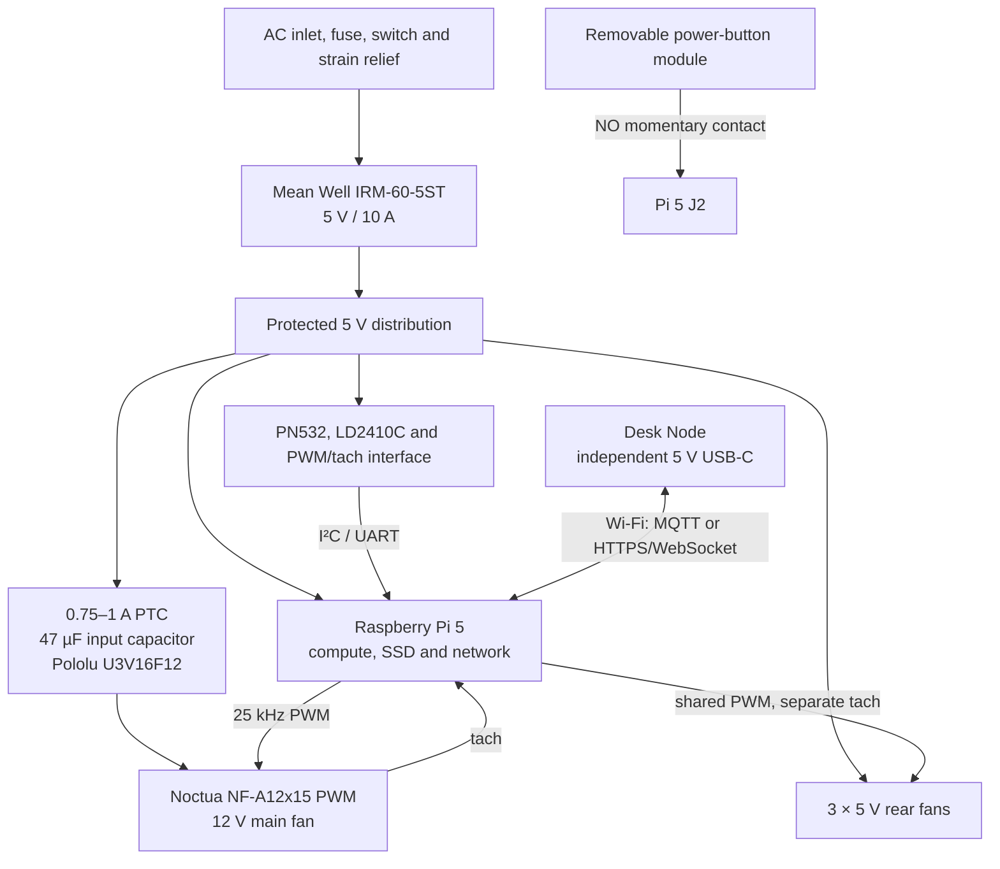

# Raspberry Pi Studio V1 Functional Architecture and System Acceptance Specification

Version: 1.1  
Date: 2026-07-26  
Units: V, A, W, °C, Hz and RPM unless stated otherwise

This document completes the functional design that was only summarized in the manufacturing report. Mechanical dimensions, enclosure geometry, ventilation and printing requirements remain governed by `Raspberry_Pi_Studio_Manufacturing_Report_EN.md`.

## 1. Evidence labels

| Label | Meaning |
|---|---|
| Model-verified | Blender geometry, installation volume, collision or airflow clearance was checked |
| Engineering design value | Suitable as an implementation starting point, but not a measured result |
| Hardware validation required | Must pass on the purchased electronics, wiring and printed parts before design freeze |

The mechanical reasonableness audit is complete. PCB implementation, cable-harness validation, EMC, product safety, CFD and full-system thermal qualification have not yet been completed. This document therefore distinguishes feasible engineering from hardware-proven performance.

## 2. Required functions

Raspberry Pi Studio V1 shall provide:

1. Raspberry Pi 5 compute, storage and network services.
2. A single 5 V low-voltage system, with an independently protected 5-to-12 V main-fan branch.
3. Temperature control, RPM feedback and fault detection for one 120 mm main fan and three 40 mm rear fans.
4. A top-centre PN532/BR-008 NFC reader.
5. LD2410C presence sensing for wake, idle and user-interface automation only.
6. A functional external power button connected to Raspberry Pi 5 J2.
7. A separately powered Desk Node touch HMI.
8. Service access to fans, power electronics, sensors and NFC after removal of the central bottom cover.

## 3. System architecture



## 4. Power architecture

### 4.1 AC and primary 5 V rail

Recommended order:

```text
IEC inlet
  → compliant fuse
  → double-pole or locally compliant switch
  → insulated terminals and strain relief
  → Mean Well IRM-60-5ST
  → covered 5 V distribution point
```

- Physically separate and secure mains wiring from SELV wiring.
- Prevent the service cover from pinching conductors.
- Install the IRM-60-5ST, fuse, wire ratings and clearances to the manufacturer data and local code.
- The model verifies only the installation envelope; it is not a product-safety certification.
- Desk Node uses an independent 5 V USB-C supply and is excluded from the internal 10 A budget.

### 4.2 Planning budget for the 5 V rail

These are conservative branch limits, not measured consumption.

| Branch | Planned 5 V limit | Note |
|---|---:|---|
| Raspberry Pi 5, SSD and USB devices | 5.0 A | reserves for compute load and USB peripherals |
| 12 V main-fan boost branch | 0.6 A | includes conversion loss, startup and margin |
| Three 5 V rear fans | 0.3 A | rated sum plus margin |
| PN532, LD2410C, PWM/tach and status LEDs | 0.4 A | refine after hardware measurement |
| Transient and future reserve | 1.7 A | not a guaranteed continuous spare output |
| Planned total | 8.0 A | approximately 40 W at 5 V |
| IRM-60-5ST rating | 10.0 A | 2.0 A / 20% nominal reserve |

Acceptance testing shall measure the 5 V rail at the Pi while CPU, SSD, USB, networking, all fans and Desk Node communications are active. Pi undervoltage status and harness temperature are acceptance criteria.

### 4.3 Recommended branch protection

| Branch | Protection |
|---|---|
| Pi/SSD | protected 5 A-class branch, finalized against the distribution board and wire gauge |
| Main-fan boost input | 0.75–1 A PTC or fuse |
| Main-fan 12 V output | approximately 0.25 A fuse or resettable protection near the converter |
| Three rear fans | 0.5 A-class protection |
| NFC/sensors | 0.5 A-class protection |

The Pololu U3V16F12 does not provide complete output-short or reverse-polarity protection. Use keyed connectors; never make the 12 V output interchangeable with a 5 V connector.

## 5. Main and rear fans

### 5.1 Main-fan electrical specification

Noctua NF-A12x15 PWM:

- 120 × 120 × 15 mm, 105 × 105 mm mounting pitch.
- 12 V, 0.13 A / 1.56 W maximum.
- Approximately 450 RPM at 20% PWM, stop at 0%, maximum 1850 RPM.
- Open-collector tach output, two pulses per revolution.
- PWM target 25 kHz; permitted range 21–28 kHz.

```text
RPM = tach_frequency_Hz × 60 ÷ 2
```

### 5.2 PWM driver

The preferred implementation uses two stages of a 74HCT14 or equivalent CMOS buffer:

```text
Pi GPIO18
  → 10 kΩ pull-up to 3.3 V for full-speed command while the GPIO is high impedance
  → 74HCT14 stage 1
  → 74HCT14 stage 2
  → main-fan PWM input
```

Two inversions preserve the commanded duty cycle. Power the buffer from 5 V and keep the output within the fan PWM input rating. A 2N7002/2N2222 open-drain implementation is acceptable only after oscilloscope validation of rise time, logic low and duty-cycle accuracy across 21–28 kHz.

Fail-safe requirements:

- An unbooted Pi, crashed service or high-impedance GPIO shall command full fan speed.
- Never supply the fan motor from a Pi GPIO or the Pi 5 V header.
- Pi, converter and fan grounds shall be common.

### 5.3 Initial thermal curve

This is a commissioning baseline and must be tuned against measured temperature and noise.

| CPU temperature | Main fan | Rear fans |
|---:|---:|---:|
| Below 45°C | 0%, stop permitted | 0% |
| 45–55°C | 20–35% | 20% |
| 55–65°C | 35–55% | 25–40% |
| 65–75°C | 55–80% | 40–70% |
| Above 75°C | 100% | 100% |

Controller rules:

- One-second samples with a five-second moving average.
- 3°C down-ramp hysteresis and a 20-second down-ramp delay.
- A one-second 100% startup kick when starting from 0%.
- Learn and store the minimum stable duty for each physical fan.

### 5.4 Fan fault handling

If command duty is above 30% and tach stays below 30% of that fan's measured minimum RPM for three seconds:

1. Log `fan_stall`.
2. Apply 100% for two seconds.
3. Retry no more than three times.
4. If the main fan still fails, set all rear fans to 100% and show a red Desk Node alarm.
5. If CPU temperature continues to rise, perform a controlled shutdown using a limit established during hardware validation.

The three rear fans may share one PWM signal, but each requires a separate tach input to identify the failed fan.

## 6. Recommended Raspberry Pi 5 pin reservation

This is a pin plan, not evidence of a completed harness. Confirm the chosen OS, overlays, PWM implementation and attached HATs before wiring.

| Function | BCM GPIO | Header pin | Interface / constraint |
|---|---:|---:|---|
| PN532 SDA | GPIO2 | 3 | I²C1 SDA, 3.3 V logic |
| PN532 SCL | GPIO3 | 5 | I²C1 SCL, 3.3 V logic |
| PN532 IRQ, optional | GPIO17 | 11 | omit if polling |
| PN532 Reset, optional | GPIO27 | 13 | confirm the purchased BR-008 board |
| Main-fan PWM | GPIO18 | 12 | 25 kHz through two-stage CMOS buffer |
| Main-fan tach | GPIO23 | 16 | 10 kΩ pull-up to 3.3 V |
| Shared rear-fan PWM | GPIO19 | 35 | 25 kHz through two-stage CMOS buffer |
| Rear fan 1 tach | GPIO24 | 18 | separate counter |
| Rear fan 2 tach | GPIO25 | 22 | separate counter |
| Rear fan 3 tach | GPIO16 | 36 | separate counter |
| LD2410C TX → Pi RX | GPIO15 | 10 | UART; disable the Linux serial console |
| Pi TX → LD2410C RX | GPIO14 | 8 | UART; 3.3 V logic |
| Power button | J2 | — | NO momentary contact; not a general GPIO |
| RTC battery | J5 | — | Pi 5-compatible rechargeable battery and correct plug |

## 7. Power-button function

The removable module consists of the Ø8.56 mm moving cap, guide, retaining flange, Omron B3F-1002 and carrier. Designed travel is 0.55 mm with 0.226 mm radial clearance per side.

Rules:

- Connect only the B3F-1002 normally-open contact across the two Pi 5 J2 pads.
- Apply no external voltage and never connect J2 to 5 V.
- Use a twisted pair and a locking removable connector.

| Pi state | Action | Expected result |
|---|---|---|
| Halted with 5 V present | Short press | Start |
| Raspberry Pi OS Lite running | Short press | Request orderly shutdown |
| Raspberry Pi OS Desktop running | Short press | Desktop-defined power menu/action |
| System unresponsive | Long press | Forced power-off; last resort only |

Perform 100 physical press cycles and reject any sticking, false activation or guide rubbing.

## 8. PN532/BR-008 NFC

### 8.1 Mount and service

- The PN532 is centered on the inside top surface, within a 48 × 48 × 4 mm envelope.
- The 52 × 52 mm carrier is bonded to the cover; the board is retained by side guides, a rear stop and a releasable front latch.
- Use a keyed locking connector and approximately 50 mm service loop.
- Service requires removal of the central bottom cover, connector release and latch release. Adhesive is not disturbed.

### 8.2 RF conditions

- Feasible behind a non-conductive FDM/resin top.
- A conductive aluminum top requires a non-metallic RF window above the antenna.
- Do not place foil, metal logo inserts or conductive coatings over the antenna.
- Maximize distance from the boost converter, AC wiring and fan motors.

### 8.3 Software behavior

1. Probe I²C and verify PN532 response during boot.
2. Debounce a tag event for 500 ms.
3. Do not repeat while the same tag remains present.
4. Permit the same UID again only after one second absent.
5. Report accepted, rejected and read-error states to Desk Node.
6. A UID is an identifier, not secure authentication. Sensitive actions require a cryptographic credential or an additional factor.

Acceptance testing shall use the intended tags at the centre and four corners, 20 attempts per point, recording range and success rate.

## 9. LD2410C presence sensing

The UART-connected LD2410C may:

- Wake Desk Node or increase update rate when a user approaches.
- Dim the display and suspend nonessential animation after an idle timeout.
- Publish local occupancy state for automation.

It shall not:

- Provide life-safety, access-control, security-alarm or emergency-stop functions.
- Assert that a space is certainly empty.

Retune gates and sensitivity with the final enclosure closed, at every fan speed and in the real desk environment. Reject unacceptable false triggers from vibration, moving fan blades or movement outside the intended zone.

## 10. Desk Node

### 10.1 Hardware responsibility

Waveshare ESP32-S3-Touch-LCD-4.3B:

- 4.3-inch 800 × 480 capacitive display.
- 2.4 GHz Wi-Fi and BLE 5.
- 16 MB Flash and 8 MB PSRAM.
- Approximately 5 V 450 mA, supplied by an independent 5 V / 2 A USB-C source.
- Flat front glass, encoder and three buttons below the display.
- No rear vents; a 1 mm thermal pad couples the board to the internal aluminum spreader.

### 10.2 Minimum UI data

- CPU temperature, fan duties and four RPM values.
- 5 V undervoltage/power warnings.
- SSD, network and service status.
- Most recent NFC event.
- Presence state.
- Quiet, Balanced and Performance thermal profiles.
- Maintenance mode and fault log.

### 10.3 Default controls

| Control | Default action |
|---|---|
| Encoder turn | navigate or adjust |
| Encoder short press | confirm |
| Left button | back |
| Centre button | home |
| Right button | shortcut page / Quiet profile |
| Touch | page navigation and direct control |

Mappings shall be configuration-driven rather than hard-coded into the UI.

### 10.4 Communications

Use MQTT over TLS or HTTPS plus WebSocket on a trusted LAN:

```text
rpi-studio/<device-id>/telemetry
rpi-studio/<device-id>/event
rpi-studio/<device-id>/command
rpi-studio/<device-id>/availability
```

Requirements:

- Commands carry a monotonic sequence or UUID to prevent replay/duplicate execution.
- Studio responds with success, rejection or timeout.
- Loss of Desk Node affects only display and remote control; local fan control continues.
- Desk Node never switches mains power directly.
- Provision per-device credentials or a high-entropy key; do not ship a shared default password.

### 10.5 Passive thermal protection

- Reduce backlight and animation rate when the board becomes warm.
- Disable IR transmission and nonessential radio activity if temperature continues to rise.
- Perform a two-hour soak with full brightness, continuous Wi-Fi, repeated touch and IR activity.
- Target an accessible surface below 45°C; finalize limits against materials, component ratings and measured results.

## 11. Raspberry Pi software structure

Use one least-privilege systemd service as the hardware owner:

```text
rpi-studio-hardware.service
  ├── thermal controller
  ├── PWM output and tach counters
  ├── PN532 I²C reader
  ├── LD2410C UART parser
  ├── bounded local event log
  └── authenticated Desk Node API
```

| Module | Responsibility |
|---|---|
| `thermal` | temperature input, hysteresis and fan curves |
| `fan_io` | PWM, tach, startup kick and stall retry |
| `nfc` | tag read/debounce; authorization remains upstream |
| `presence` | UART parsing, occupied state and timeout |
| `telemetry` | Desk Node and local metrics |
| `command` | authenticated commands, profiles and maintenance mode |
| `watchdog` | restart service and restore fan-safe behavior |

Design rules:

- Fan control never depends on Desk Node or networking.
- Configuration updates are atomic and preserve the last valid version.
- PWM hardware remains fail-safe until valid tach readings are obtained.
- Bound and rotate logs to prevent storage exhaustion.

## 12. Operating sequences

### 12.1 Startup

1. AC and 5 V stabilize.
2. PWM hardware defaults fans to full speed.
3. Pi boots and starts the hardware service.
4. Verify four tach inputs, PN532, LD2410C and RTC.
5. Check Pi undervoltage status.
6. Enter the automatic curve only after required checks pass.
7. Publish Desk Node availability.

### 12.2 Normal operation

- Update thermal control every second.
- Publish normal telemetry every five seconds and events immediately.
- A sensor timeout disables only that sensor function.
- A fan failure enters degraded cooling mode and raises an alarm.

### 12.3 Orderly shutdown

1. Stop accepting nonessential commands.
2. Flush the final state and fault log.
3. Notify Desk Node.
4. Request an orderly OS shutdown.
5. Preserve the hardware fan-safe state; actual stopped behavior depends on the final 5 V power arrangement.

## 13. Failure response

| Fault | Detection | Response |
|---|---|---|
| Main fan stalled | duty >30% with low tach | three retries, rear fans 100%, alarm, controlled shutdown if necessary |
| One rear fan stalled | individual tach low | raise remaining fan speeds and identify failed position |
| Converter overheat / 12 V absent | main-fan tach lost | main-fan fault response; inspect converter and fuse |
| PN532 offline | no I²C response | disable NFC only |
| LD2410C offline | UART timeout | mark presence unknown; never infer empty |
| Desk Node offline | heartbeat timeout | local Pi control continues |
| Pi service crash | systemd/watchdog | restart service; hardware returns to full speed |
| 5 V undervoltage | Pi power warning | log and inspect PSU, distribution and harness |
| Invalid sensor data | range and timestamp checks | reject sample and preserve last safe state |

## 14. System acceptance checklist

### A. Unpowered

- [ ] Verify branch protection and wire gauges.
- [ ] Verify mains/SELV separation, fixation and strain relief.
- [ ] Verify no shorts between 5 V, 12 V and ground.
- [ ] Verify connector keying, labels and polarity.
- [ ] Hand-spin all four fans without contact.
- [ ] Verify free power-button return.

### B. Staged power-up

- [ ] Verify unloaded PSU output before connecting Pi or fans.
- [ ] Apply a load and verify stable 5 V and terminal temperature.
- [ ] Test converter 12 V, polarity and protection separately.
- [ ] Verify main-fan safe speed with PWM uncontrolled.
- [ ] Add rear fans, sensors and Pi one branch at a time.

### C. Functional

- [ ] J2 button starts the Pi and requests orderly shutdown.
- [ ] All four tach inputs return correct RPM.
- [ ] Record behavior at 0%, 20%, 50% and 100% PWM.
- [ ] Obstruct each fan in turn and verify alarms and retries.
- [ ] Complete centre and four-corner NFC tests.
- [ ] Verify LD2410C at every fan speed.
- [ ] Disconnect Desk Node and verify local cooling.
- [ ] Verify authenticated, acknowledged and duplicate-safe commands.

### D. Thermal and load

- [ ] Run CPU, SSD, network and USB load simultaneously for at least two hours.
- [ ] Record ambient, CPU, SSD, converter, PSU, exhaust and enclosure temperatures.
- [ ] Verify no throttling, undervoltage, restart, odor or wire softening.
- [ ] Confirm bottom intake, upward flow and rear exhaust with smoke/thread testing.
- [ ] Repeat with the bottom cover fully tightened and production feet installed.

### E. Service

- [ ] Primary service points are accessible through the central bottom cover.
- [ ] PN532 removes without disturbing adhesive.
- [ ] Main fan, converter and power-button module replace independently.
- [ ] Harnesses permit service but cannot enter fan blades.

## 15. Feasibility

### Ready for prototype implementation

- Pi 5 compute system and protected 12 V main-fan boost branch.
- 25 kHz PWM, separate tach and stall detection.
- J2 external momentary power button.
- Removable top-centre PN532 behind a non-metallic top.
- Separately powered Wi-Fi Desk Node HMI.
- LD2410C for convenience automation.

### Requires hardware validation before freeze

- Fan curves, acoustics, minimum stable duty and thermal performance.
- PN532 range through the actual top material and finish.
- LD2410C thresholds in the actual desk environment.
- Purchased BR-008, LD2410C, heatsink and harness dimensions.
- 5 V drop and converter/PSU/connector temperatures.
- Reproduction of 0.10 mm engravings and Ø1.30 mm holes on the selected FDM process.

### Claims not permitted yet

- No CFD-optimized airflow claim before CFD and smoke testing.
- No EMC or product-safety compliance claim before certification.
- UID reading is not secure authentication.
- LD2410C is not a life-safety sensor.
- NFC is not claimed to work through a conductive top without an RF window.

## 16. Primary official sources

- Raspberry Pi 5 power button and J2: <https://www.raspberrypi.com/documentation/hardware/displays/raspberry-pi-5.html>
- Raspberry Pi 5 RTC and J5: <https://www.raspberrypi.com/documentation/computers/raspberry-pi.html>
- Noctua NF-A12x15 PWM: <https://www.noctua.at/en/products/nf-a12x15-pwm/specifications>
- Noctua PWM technical paper: <https://noctua.at/pub/media/wysiwyg/Noctua_PWM_specifications_white_paper.pdf>
- Pololu U3V16F12: <https://www.pololu.com/product/4945>
- Mean Well IRM-60: <https://www.meanwell.com/Upload/PDF/IRM-60/IRM-60-SPEC.PDF>
- Waveshare ESP32-S3-Touch-LCD-4.3B: <https://www.waveshare.com/wiki/ESP32-S3-Touch-LCD-4.3B>
