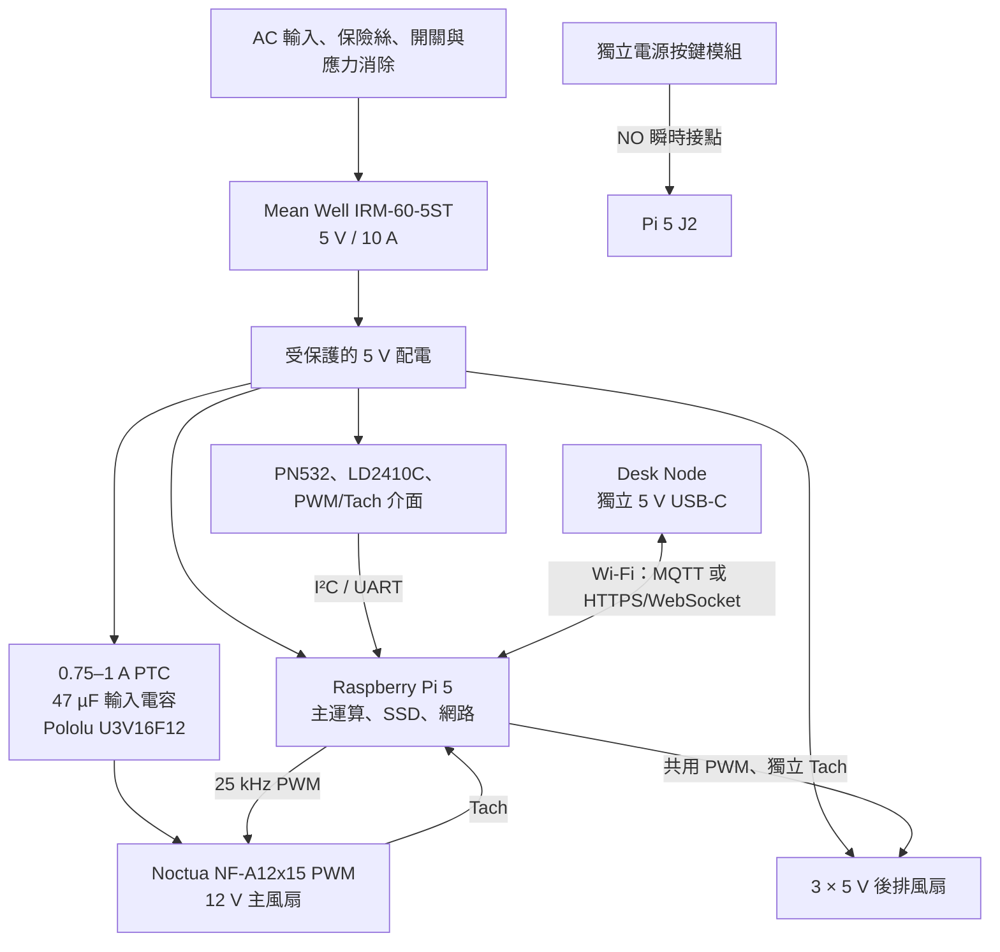

# Raspberry Pi Studio V1 功能架構與整機驗收規格

版本：1.1  
日期：2026-07-26  
單位：V、A、W、°C、Hz、RPM，除非另有註明

本文件補足製造報告中的功能設計。機構尺寸、外殼、散熱孔與列印規格仍以 `Raspberry_Pi_Studio_Manufacturing_Report_ZH-TW.md` 為準。

## 1. 文件狀態與判讀方式

| 標記 | 意義 |
|---|---|
| 已由模型驗證 | Blender 幾何、安裝空間、碰撞或風道淨空已檢查 |
| 工程設計值 | 可作為接線、韌體與測試起點，但尚非實測結果 |
| 實機必測 | 必須在實際購買零件、線材與列印件上通過後才能定案 |

本專案目前已完成機構合理性檢查，但尚未完成 PCB、線束、電磁相容、安規、CFD 或整機溫升認證。因此本文將「可實作」與「已在實物證明」分開陳述。

## 2. 功能目標

Raspberry Pi Studio V1 應提供：

1. Raspberry Pi 5 的主運算、儲存與網路功能。
2. 5 V 單一外部低壓系統，主風扇以獨立升壓支路取得 12 V。
3. 一個 120 mm 主風扇與三個 40 mm 後排風扇的溫控、轉速回授與故障偵測。
4. 頂部中央 PN532／BR-008 NFC 讀取功能。
5. LD2410C 人體存在偵測，用於喚醒、待機與介面自動化，不作安全防護。
6. 可實際按壓的外置電源按鍵，連接 Raspberry Pi 5 J2。
7. Desk Node 作為獨立供電的觸控式遠端狀態與控制介面。
8. 拆除中央底蓋後，可維修風扇、電源支路、感測器與 NFC 模組。

## 3. 整機功能方塊圖



## 4. 電源架構

### 4.1 AC 與 5 V 主電源

建議順序：

```text
IEC 輸入
  → 合規保險絲
  → 雙極或符合當地規範的電源開關
  → 絕緣端子與應力消除
  → Mean Well IRM-60-5ST
  → 具護蓋的 5 V 配電點
```

- AC 區與 SELV 低壓區必須分隔、固定並防止線材被底蓋夾傷。
- IRM-60-5ST 的安裝、保險絲、導線額定與爬電距離必須依原廠資料及當地法規處理。
- 本模型只能確認安裝包絡，不能視為安規認證。
- Desk Node 使用獨立 USB-C 5 V 電源，不計入 Studio 內部 10 A 預算。

### 4.2 5 V 規劃功率預算

這是保守的「支路上限」，不是實測耗電。

| 支路 | 5 V 規劃上限 | 備註 |
|---|---:|---|
| Raspberry Pi 5、SSD 與 USB 裝置 | 5.0 A | 以高負載與 USB 周邊預留 |
| 12 V 主風扇升壓支路 | 0.6 A | 含升壓損耗、啟動及設計餘量 |
| 三個 5 V 後排風扇 | 0.3 A | 額定總和再留餘量 |
| PN532、LD2410C、PWM/Tach 與狀態燈 | 0.4 A | 實物確認後可下修 |
| 未來擴充與瞬態餘量 | 1.7 A | 不應被當作長期可用額定 |
| 合計規劃值 | 8.0 A | 5 V 約 40 W |
| IRM-60-5ST 額定 | 10.0 A | 保留 2.0 A／20% 名義餘量 |

驗收時需在 CPU、SSD、USB、全部風扇與 Desk Node 通訊同時運作下量測 5 V；Pi 端電壓、電源告警與線束溫升都必須合格。

### 4.3 建議支路保護

| 支路 | 建議保護 |
|---|---|
| Pi／SSD | 獨立 5 A 等級受保護支路；依實際配電板與線徑定案 |
| 主風扇升壓輸入 | 0.75–1 A PTC 或保險絲 |
| 主風扇 12 V 輸出 | 0.25 A 級保險絲或可復歸保護，靠近升壓板 |
| 三個後排風扇 | 0.5 A 級保護 |
| NFC／感測器 | 0.5 A 級保護 |

Pololu U3V16F12 沒有完整輸出短路與反接保護；接頭必須防呆，12 V 輸出不可裸露或與 5 V 插頭互換。

## 5. 主風扇與後排風扇

### 5.1 主風扇電氣

Noctua NF-A12x15 PWM：

- 尺寸 120 × 120 × 15 mm，孔距 105 × 105 mm。
- 12 V，最大輸入 0.13 A／1.56 W。
- 20% PWM 約 450 RPM；0% PWM 停止；最高 1850 RPM。
- Tach 為開集極輸出，每轉兩個脈衝。
- PWM 目標頻率 25 kHz，可接受 21–28 kHz。

計算式：

```text
RPM = Tach_frequency_Hz × 60 ÷ 2
```

### 5.2 PWM 驅動電路

最終版優先採用兩級 74HCT14／同級 CMOS 緩衝器，而不是把 GPIO 直接接到風扇：

```text
Pi GPIO18
  → 10 kΩ 上拉至 3.3 V，確保 GPIO 高阻抗時為全速命令
  → 74HCT14 第 1 級
  → 74HCT14 第 2 級
  → 主風扇 PWM
```

兩次反相保留原始占空比。緩衝器以 5 V 供電，輸出不得超過風扇 PWM 腳允許值。若仍使用 2N7002／2N2222 開汲極方案，必須以示波器確認 21–28 kHz 下的上升沿、低準位與占空比，才可視為合格。

失效安全原則：

- Pi 未開機、服務崩潰或 GPIO 高阻抗時，主風扇應回到全速，而不是停止。
- 風扇馬達電源不得由 Pi GPIO 或 5 V header 提供。
- 風扇、升壓板與 Pi 必須共地。

### 5.3 建議溫控曲線

以下為工程起始值，需依實機噪音與溫度調整：

| CPU 溫度 | 主風扇 | 後排風扇 |
|---:|---:|---:|
| 低於 45°C | 0%，允許停轉 | 0% |
| 45–55°C | 20–35% | 20% |
| 55–65°C | 35–55% | 25–40% |
| 65–75°C | 55–80% | 40–70% |
| 75°C 以上 | 100% | 100% |

控制要求：

- 溫度取樣週期 1 秒。
- 5 秒移動平均，避免瞬時尖峰。
- 降速遲滯 3°C，降速延遲 20 秒。
- 由 0% 啟動時先給 100% 1 秒，再降至目標占空比。
- 啟動後必須學習每顆風扇的最低穩定占空比。

### 5.4 風扇故障偵測

當命令占空比高於 30% 且 Tach 連續 3 秒低於該風扇實測最低 RPM 的 30%：

1. 記錄 `fan_stall`。
2. 對該風扇執行 100%／2 秒重新啟動。
3. 最多重試三次。
4. 主風扇仍失敗時，三個後排風扇轉 100%，Desk Node 顯示紅色告警。
5. CPU 溫度持續上升時，由作業系統執行受控關機；臨界值須以實測及 Raspberry Pi 官方設定為準。

後排三個風扇可共用一條 PWM，但 Tach 必須分開，否則無法辨識是哪一顆停止。

## 6. Raspberry Pi 5 建議腳位表

以下是保留腳位方案，不是接線完成證明。使用前需確認所選作業系統、核心 overlay、PWM 函式庫及 HAT 沒有占用相同腳位。

| 功能 | BCM GPIO | 實體腳位 | 介面／注意事項 |
|---|---:|---:|---|
| PN532 SDA | GPIO2 | 3 | I²C1 SDA，3.3 V 邏輯 |
| PN532 SCL | GPIO3 | 5 | I²C1 SCL，3.3 V 邏輯 |
| PN532 IRQ（選用） | GPIO17 | 11 | 不使用時可省略 |
| PN532 Reset（選用） | GPIO27 | 13 | 依 BR-008 板型確認 |
| 主風扇 PWM | GPIO18 | 12 | 25 kHz，經兩級 CMOS 緩衝 |
| 主風扇 Tach | GPIO23 | 16 | 10 kΩ 上拉至 3.3 V |
| 後排風扇 PWM 共用 | GPIO19 | 35 | 25 kHz，經兩級 CMOS 緩衝 |
| 後排風扇 1 Tach | GPIO24 | 18 | 獨立計數 |
| 後排風扇 2 Tach | GPIO25 | 22 | 獨立計數 |
| 後排風扇 3 Tach | GPIO16 | 36 | 獨立計數 |
| LD2410C TX → Pi RX | GPIO15 | 10 | UART；停用 Linux serial console |
| Pi TX → LD2410C RX | GPIO14 | 8 | UART；3.3 V 邏輯 |
| 電源按鍵 | J2 | — | NO 瞬時開關，禁止改接一般 GPIO |
| RTC 電池 | J5 | — | 使用 Pi 5 相容可充電電池與正確插頭 |

## 7. 電源按鍵功能

電源按鍵由 Ø8.56 mm 可動帽、導套、保持凸緣、Omron B3F-1002 與支架組成。可動件單邊設計間隙 0.226 mm，設計行程 0.55 mm。

連接規則：

- B3F-1002 的 NO 接點只跨接 Pi 5 J2 兩端。
- 不外加電壓，不接 5 V，不把 J2 當 GPIO。
- 使用雙芯絞線與可拔式鎖定接頭。

預期行為：

| Pi 狀態 | 操作 | 預期結果 |
|---|---|---|
| 關機但 5 V 仍在 | 短按 | 啟動 |
| Raspberry Pi OS Lite 運行 | 短按 | 觸發正常關機 |
| Raspberry Pi OS Desktop 運行 | 短按 | 依桌面環境顯示電源選單 |
| 系統失去回應 | 長按 | 強制關機；僅作最後手段 |

實機需做 100 次按壓循環，確認無卡住、誤觸或孔邊摩擦。

## 8. NFC／BR-008 功能

### 8.1 安裝與維修

- PN532 位於頂部幾何正中央，設計包絡 48 × 48 × 4 mm。
- 52 × 52 mm 固定座黏在頂蓋內側；模組本身以滑軌、後擋與前卡榫固定。
- 使用防呆鎖定接頭及約 50 mm 維修線圈。
- 維修時拆底部中央蓋、拔接頭、解除卡榫即可取出模組，不需重新黏膠。

### 8.2 RF 條件

- 非導電 FDM／樹脂頂蓋：可行。
- 鋁或其他導電頂蓋：必須在天線正上方設置非金屬 RF 視窗。
- 天線與頂面間不可有鋁箔、銅箔、金屬 Logo 片或大面積導電塗層。
- PN532 與升壓板、AC 線束及風扇馬達保持最大可行距離。

### 8.3 軟體行為

1. 開機掃描 I²C 裝置並確認 PN532 回應。
2. 讀卡事件去抖 500 ms；同一卡片持續停留不重複觸發。
3. 卡片移開 1 秒後，才允許同 UID 再次觸發。
4. Desk Node 顯示成功、拒絕或讀取錯誤。
5. UID 只能作識別提示，不能單獨作高安全性身分驗證；敏感操作應使用加密卡片或額外認證。

實機驗收必須用預定卡片，在中心與四角各測 20 次，記錄成功率與有效距離。

## 9. LD2410C 人體存在偵測

LD2410C 透過 UART 連接 Pi。功能只用於：

- 有人靠近時喚醒 Desk Node 或提高更新頻率。
- 無人一段時間後降低螢幕亮度、停止非必要動畫。
- 記錄占用狀態供本地自動化使用。

不得用於：

- 人身安全、門禁、防盜或緊急停止。
- 判定空間內一定沒有人。

安裝後需在機殼關閉、風扇各轉速、桌面反射物與實際座位條件下重新調整距離閘與靈敏度，避免風扇振動或外部走動造成誤報。

## 10. Desk Node 功能

### 10.1 硬體職責

Desk Node 使用 Waveshare ESP32-S3-Touch-LCD-4.3B：

- 4.3 吋、800 × 480 電容觸控。
- 2.4 GHz Wi-Fi、BLE 5。
- 16 MB Flash、8 MB PSRAM。
- 5 V 約 450 mA，使用獨立 5 V／2 A USB-C 電源。
- 平面前玻璃；旋鈕與三個按鈕位於螢幕下方。
- 背面不開散熱孔；1 mm 導熱墊接內部鋁均熱片。

### 10.2 顯示內容

最低功能集合：

- CPU 溫度、風扇占空比與四顆風扇 RPM。
- 5 V 欠壓／電源告警。
- SSD、網路與服務狀態。
- NFC 最近事件。
- 人體存在狀態。
- 靜音、平衡、效能三種風扇設定檔。
- 維護模式與故障紀錄。

### 10.3 操作配置

| 控制件 | 預設行為 |
|---|---|
| 旋鈕旋轉 | 移動選項或調整數值 |
| 旋鈕短按 | 確認 |
| 左按鈕 | 返回 |
| 中按鈕 | 回主畫面 |
| 右按鈕 | 切換快捷頁／靜音設定檔 |
| 觸控 | 頁面與直接控制 |

所有按鍵功能應由設定檔重新映射，不寫死在 UI 程式。

### 10.4 通訊

建議在受信任 LAN 上使用 MQTT over TLS，或 HTTPS + WebSocket：

```text
rpi-studio/<device-id>/telemetry
rpi-studio/<device-id>/event
rpi-studio/<device-id>/command
rpi-studio/<device-id>/availability
```

要求：

- 命令需包含遞增序號或 UUID，避免重送。
- Studio 回覆成功、拒絕或逾時。
- Desk Node 失聯時只失去顯示與遙控；Pi 的風扇控制仍在本機運作。
- Desk Node 不得直接控制 AC 電源。
- 初次配對後保存每台裝置獨立憑證或高熵密鑰，不使用共用預設密碼。

### 10.5 被動散熱保護

Desk Node 韌體需監測 ESP32-S3 溫度或使用可取得的熱指標：

- 溫度偏高時先降低背光與動畫更新率。
- 仍持續上升時停用 IR 發射與非必要無線活動。
- 實機在全亮度、持續 Wi-Fi、連續觸控與 IR 工作下進行至少兩小時熱浸。
- 外殼表面目標低於 45°C；最終限制依材料、零件額定及實測設定。

## 11. Raspberry Pi 軟體架構

建議以一個具最小權限的 systemd 服務統一擁有硬體：

```text
rpi-studio-hardware.service
  ├── thermal controller
  ├── PWM output and tach counters
  ├── PN532 I²C reader
  ├── LD2410C UART parser
  ├── local event log
  └── authenticated Desk Node API
```

功能模組：

| 模組 | 職責 |
|---|---|
| `thermal` | 讀溫度、套用遲滯與風扇曲線 |
| `fan_io` | PWM、Tach、啟動脈衝、卡轉重試 |
| `nfc` | 讀卡、去抖、權限交由上層判定 |
| `presence` | UART 解析、占用狀態與逾時 |
| `telemetry` | 產生 Desk Node 與本地紀錄資料 |
| `command` | 驗證命令、設定檔與維護模式 |
| `watchdog` | 服務失效時恢復風扇安全狀態 |

重要原則：

- 風扇控制不依賴 Desk Node 或網路。
- 設定檔寫入採原子更新，保留上一份有效設定。
- 啟動時 PWM 腳保持硬體失效安全狀態，待 Tach 讀取正常後才降速。
- 日誌需限制大小，避免寫滿 SSD／microSD。

## 12. 開機、運作與關機序列

### 12.1 開機

1. AC 與 5 V 穩定。
2. PWM 硬體預設讓風扇全速。
3. Pi 開機並啟動硬體服務。
4. 驗證四個 Tach、PN532、LD2410C 與 RTC。
5. 檢查 5 V 欠壓狀態。
6. 所有必要檢查通過後切入自動風扇曲線。
7. 發布 Desk Node `available`。

### 12.2 正常運作

- 1 秒更新熱狀態。
- 5 秒發布一般 telemetry；事件立即發布。
- 感測器逾時只停用該功能，不停止散熱。
- 任一風扇故障進入降級模式並顯示告警。

### 12.3 關機

1. 停止接受非必要命令。
2. 寫入最後狀態及故障紀錄。
3. 通知 Desk Node 顯示關機中。
4. 執行作業系統正常關機。
5. 保留硬體預設風扇安全狀態；是否停轉需依 5 V 實際供電狀態確認。

## 13. 故障模式與處理

| 故障 | 偵測 | 系統反應 |
|---|---|---|
| 主風扇卡轉 | PWM >30% 且 Tach 過低 | 重試三次；後排全速；告警；必要時受控關機 |
| 單一後排風扇卡轉 | 該 Tach 過低 | 其餘風扇升速；顯示故障位置 |
| 升壓板過熱／12 V 消失 | 主風扇 Tach 歸零 | 同主風扇故障；檢查保險絲與升壓板 |
| PN532 離線 | I²C 無回應 | 停用 NFC；不影響冷卻與主機 |
| LD2410C 離線 | UART 逾時 | 占用狀態標記未知；不自動判斷無人 |
| Desk Node 離線 | 心跳逾時 | Pi 繼續本地控制；記錄失聯 |
| Pi 服務崩潰 | systemd／watchdog | 自動重啟服務；硬體回全速 |
| 5 V 欠壓 | Pi 電源告警 | 提升風扇不一定能解決；記錄並要求檢查 PSU／線束 |
| 感測器資料異常 | 範圍與時間戳檢查 | 捨棄資料，保持上次安全狀態 |

## 14. 整機驗收程序

### A. 未上電

- [ ] 核對所有支路保險絲與線徑。
- [ ] 確認 AC 與 SELV 線束分隔、固定與應力消除。
- [ ] 檢查 5 V、12 V、GND 無短路。
- [ ] 確認所有接頭防呆、標籤與極性。
- [ ] 手動旋轉四個風扇，確認無刮碰。
- [ ] 電源按鍵能自由回彈。

### B. 分段上電

- [ ] 不接 Pi 與風扇，確認 PSU 空載 5 V。
- [ ] 接假負載，確認 5 V 穩定及端子無異常溫升。
- [ ] 單獨測試升壓支路 12 V、極性與保護。
- [ ] 接主風扇，確認 PWM 未控制時為安全轉速。
- [ ] 分別接入後排風扇、感測器與 Pi。

### C. 功能

- [ ] J2 短按可啟動並觸發正常關機。
- [ ] 四個 Tach 都能讀取，RPM 計算正確。
- [ ] 0%、20%、50%、100% PWM 實測並記錄。
- [ ] 人工阻擋每顆風扇，故障告警與重試正確。
- [ ] PN532 中心與四角讀卡測試完成。
- [ ] LD2410C 在風扇各轉速下無不可接受誤報。
- [ ] Desk Node 斷線時，Studio 仍正常散熱。
- [ ] Desk Node 命令具驗證、回覆及防重送。

### D. 熱與負載

- [ ] CPU、SSD、網路與 USB 同時高負載至少兩小時。
- [ ] 記錄環境、CPU、SSD、升壓板、PSU、出風與外殼溫度。
- [ ] 確認無降頻、欠壓、重啟、異味或線束軟化。
- [ ] 以煙流或細絲確認底部吸氣、向上流動及後方排氣。
- [ ] 重複測試「底蓋完全鎖緊」與實際腳墊高度。

### E. 維修

- [ ] 僅拆中央底蓋即可接觸主要維修點。
- [ ] PN532 可在不破壞黏膠下抽出。
- [ ] 主風扇、升壓板與按鍵模組可單獨更換。
- [ ] 線束長度足夠拆裝，但不會進入風扇葉片。

## 15. 可行性結論

### 可直接進入原型製作

- Pi 5 主機、獨立 12 V 主風扇升壓支路。
- 25 kHz PWM、獨立 Tach 與卡轉偵測。
- J2 外接瞬時電源按鍵。
- 非金屬頂蓋下的中央 PN532 可抽換模組。
- Desk Node 作為獨立供電的 Wi-Fi HMI。
- LD2410C 作為舒適性／自動化感測器。

### 必須實測後才能凍結

- 風扇曲線、噪音、最低穩定占空比與整機熱表現。
- PN532 在實際頂蓋材料、塗裝及卡片下的距離。
- LD2410C 在風扇、桌面與牆面反射下的參數。
- BR-008、LD2410C、散熱器與線束的實際購買尺寸。
- 5 V 壓降、升壓板溫升、PSU 與接頭溫升。
- 0.10 mm 凹刻與 Ø1.30 mm 孔在指定 FDM 製程上的重現性。

### 不可直接宣稱

- 未做 CFD 前，不宣稱已完成流體最佳化。
- 未做 EMC／安規測試前，不宣稱符合商品法規。
- UID 讀取不等於安全身分認證。
- LD2410C 不可取代人身安全感測器。
- 金屬頂蓋未設 RF 視窗時，不宣稱 NFC 可用。

## 16. 主要官方依據

- Raspberry Pi 5 電源按鍵與 J2：<https://www.raspberrypi.com/documentation/hardware/displays/raspberry-pi-5.html>
- Raspberry Pi 5 RTC 與 J5：<https://www.raspberrypi.com/documentation/computers/raspberry-pi.html>
- Noctua NF-A12x15 PWM：<https://www.noctua.at/en/products/nf-a12x15-pwm/specifications>
- Noctua PWM 技術文件：<https://noctua.at/pub/media/wysiwyg/Noctua_PWM_specifications_white_paper.pdf>
- Pololu U3V16F12：<https://www.pololu.com/product/4945>
- Mean Well IRM-60：<https://www.meanwell.com/Upload/PDF/IRM-60/IRM-60-SPEC.PDF>
- Waveshare ESP32-S3-Touch-LCD-4.3B：<https://www.waveshare.com/wiki/ESP32-S3-Touch-LCD-4.3B>
