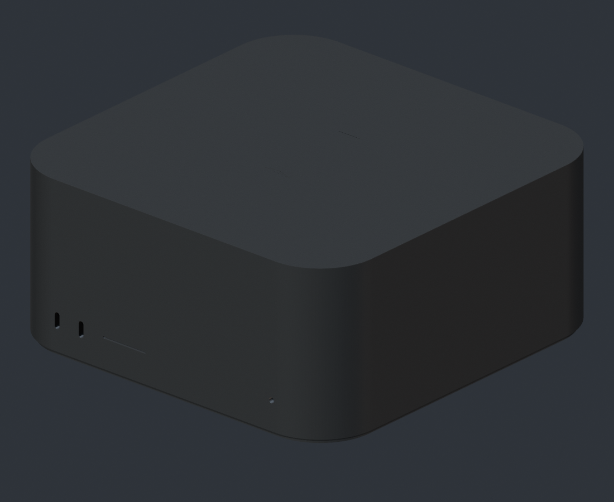
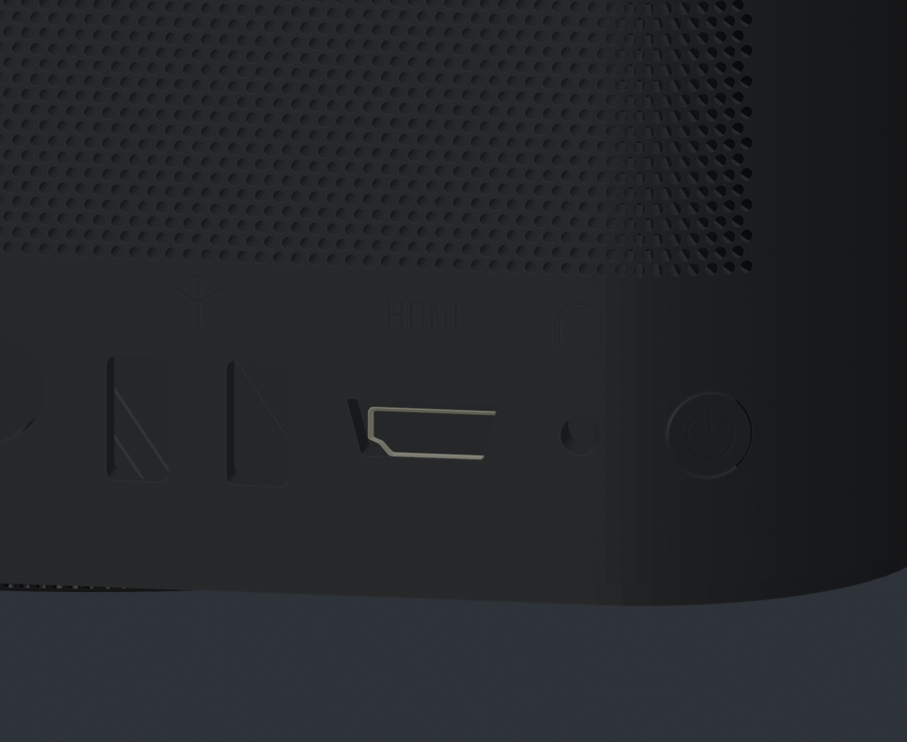
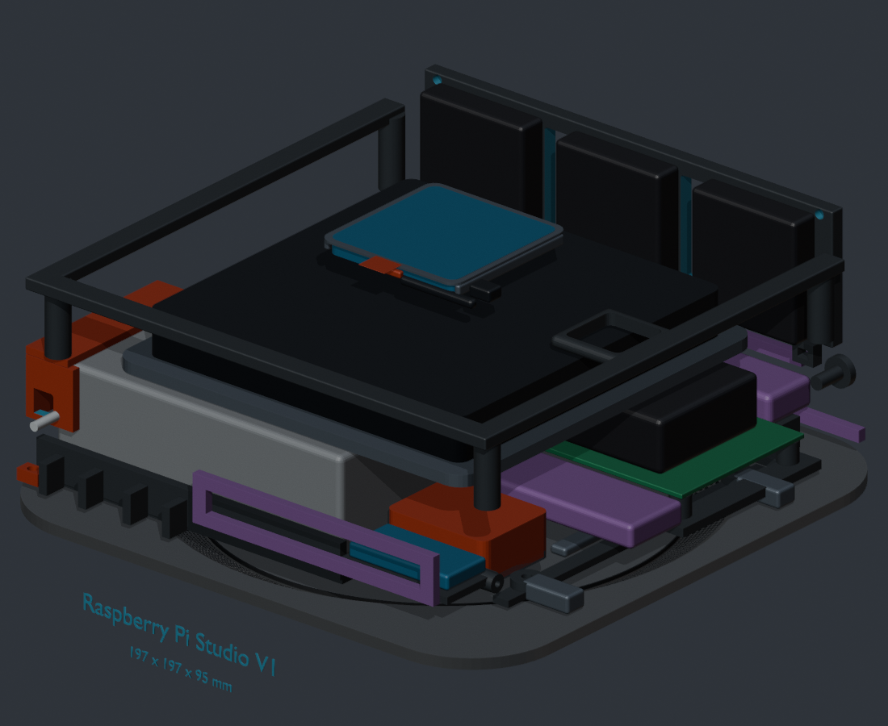

# Raspberry Pi Studio V1 Manufacturing Report

Revision: 1.1 Final  
Date: 2026-07-26  
Units: millimetres unless noted otherwise

> This document governs mechanical design, printing, assembly and materials. For power distribution, GPIO, fan control, NFC, LD2410C, Desk Node communications, failure handling and system acceptance, see `Raspberry_Pi_Studio_Functional_Architecture_EN.md`.

## 1. Report contents

This document covers the final enclosure specification, ventilation, I/O, internal layout, power-button module, BR-008, Desk Node, materials, build process, validation requirements and feasibility limits.



## 2. Final mechanical specification

| Feature | Final specification |
|---|---|
| External envelope | 197 × 197 × 95 |
| Outer body corner radius | R31.3 |
| Inner body corner radius | R26.5 |
| Nominal shell wall | 4.8 |
| Bottom outer corner radius | R29.2 |
| Bottom outer plate | 3.8 thick |
| Sloped intake annulus | 2.2 thick |
| Central service cover | Ø145.1, removable |
| Service-cover radial clearance | 0.65 |
| Apple logo | Source-2 silhouette, recessed 0.10 |
| Underside `Mac Studio` marking | 91.4 × 14.0, recessed 0.35 |
| Main fan | Noctua NF-A12x15 PWM, 120 × 120 × 15 |
| Desk Node | 142 × 12 × 102; flat front; passive cooling |

The exterior proportions were calibrated against external form references retained only in the private development project. This is a compatible reconstruction, not an Apple manufacturing drawing.

## 3. Bottom and rear ventilation

The bottom holes are cut through the raised sloped surface, not projected onto a flat base. Each hole axis follows the local surface normal.

| Bottom intake | Value |
|---|---:|
| Complete concentric rows | 8 |
| Holes per row | 288 |
| Total holes | 2,304 |
| Hole diameter | Ø1.30 |
| Adjacent-row offset | exactly one-half angular pitch |
| Solid border at inner and outer edges | 1.10 each |
| Nominal open area | 3,058.2 mm² |
| Annulus open-area ratio | 41.57% |


| Rear exhaust | Value |
|---|---:|
| Rows | 29 |
| 91-hole rows | 15 |
| 90-hole rows | 14 |
| Sequence | 91/90 alternating; rows 1, 15 and 29 contain 91 |
| Total holes | 2,625 |
| Hole diameter | Ø1.30, identical for every hole |
| Horizontal pitch | 1.85 |
| Vertical pitch | 1.602 |
| Nominal open area | 3,484.2 mm² |
| Grille open-area ratio | 45.09% |

The rows remain staggered over the flat rear wall and the R31.3 corner arcs.

## 4. I/O and exterior details

| Opening | Model envelope |
|---|---:|
| USB-C | 2.933 × 8.440 |
| SD slot | 25.898 × 0.936 |
| RJ45 | 14.480 × 13.659 |
| USB-A | 6.387 × 12.912 |
| HDMI Type-A | 15.576 × 5.855, trapezoidal lower corners |
| Audio | Ø4.054 |
| Power button | Ø9.012 |

Front and rear handedness are handled independently so the rear view is not mirrored. Thunderbolt, Ethernet, USB, HDMI, headphone and power prompts are true 0.10 mm inward engravings.



The Apple logo is a 0.10 mm recess generated from the supplied source silhouette. For FDM, print a test coupon first, use a 0.12–0.16 mm layer height, and orient the top face upward. The feature is intentionally not enlarged, so it is close to the reliable limit of high-resolution FDM.

## 5. Functional power-button module

| Feature | Specification |
|---|---:|
| Cap diameter | Ø8.56 |
| Body opening | Ø9.012 |
| Radial clearance per side | 0.226 |
| Designed travel | 0.55 |
| Switch | Omron B3F-1002 tactile, normally open |
| Electrical connection | Raspberry Pi 5 J2 momentary contact |

The cap/plunger, retaining flange, guide sleeve, switch carrier and tactile switch form a removable module. The B3F internal dome provides the press force and snap sensation; no large return spring is required. After painting, verify free movement with a gauge and lightly ream the guide if coating thickness consumes the clearance.

## 6. Cooling and power architecture

```text
Eight-row sloped bottom intake
              ↓
Open lower component chamber
              ↓
Noctua NF-A12x15 PWM, blowing upward
              ↓
Upper pressure-equalisation plenum
              ↓
Long rear grille + three independent 4010 helper fans
```

The main and rear-fan mounts do not overlap. The main fan transfers the whole lower-chamber air mass upward; the three 4010 fans are low-speed rear exhaust helpers. No continuous internal plate blocks the bottom intake.



The 12 V main fan uses an independent branch:

```text
Mean Well IRM-60-5ST, 5 V
   ├── Pi / storage / peripherals
   └── 0.75–1 A PTC
        ├── 47 µF, 25 V low-ESR input capacitor
        └── Pololu U3V16F12 fixed 12 V boost
             └── Noctua NF-A12x15 PWM
```

- Never power the fan motor from a Pi GPIO or 5 V header.
- Use a 25 kHz two-stage 74HCT14/equivalent CMOS buffer; accept an open-drain/open-collector fallback only after oscilloscope validation.
- Pull tach to 3.3 V through 10 kΩ; Noctua tach provides two pulses per revolution.
- Firmware must provide startup kick, minimum stable duty and stall detection.

## 7. BR-008 top-centre PN532

BR-008 is now located at the geometric centre of the inside top surface. The design envelope is 48 × 48 × 4.

The 52 × 52 carrier is bonded to the cover, while the PN532 board itself slides into two side guides, a rear stop and a releasable front latch. A locking connector and approximately 50 mm of service lead allow the top cover to be opened and the board removed without cutting wires or replacing adhesive.

This is serviceable, with one material restriction:

- Non-conductive FDM/resin top: top-centre NFC is feasible.
- Aluminum or conductive top: NFC coupling will be severely shielded. Add a non-metallic RF window or move the antenna behind a non-metallic front feature.

The 48 × 48 projected module area is about 16% of the 120 × 120 fan area. Vertical separation allows air to spread around it, but smoke-flow testing remains required.

## 8. Desk Node

- 142 × 12 × 102 tablet-like enclosure
- flat black front glass
- 4.3-inch 800 × 480 capacitive display
- low-profile encoder and three buttons below the screen
- no rear ventilation holes
- 1 mm thermal pad to a 116 × 78 × 0.8 internal aluminum spreader
- bottom-edge USB-C opening

The selected Waveshare ESP32-S3-Touch-LCD-4.3B standard board is 112.4 × 75.1. Passive cooling is reasonable for this class of board but must pass a two-hour worst-case thermal soak at full brightness, continuous Wi-Fi activity and IR transmission. Target an external rear-surface temperature below 45°C.

## 9. Materials and purchased parts

The principal purchased parts are listed below.

Primary components:

| Function | Selected component |
|---|---|
| Computer | Raspberry Pi 5 8 GB |
| PSU | Mean Well IRM-60-5ST, 5 V / 10 A |
| Main fan | Noctua NF-A12x15 PWM |
| Rear fans | 3 × Noctua NF-A4x10 5V PWM |
| Boost | Pololu U3V16F12 item 4945 |
| Branch protection | Bourns MF-R075 or equivalent 0.75 A hold PTC |
| Input capacitor | 47 µF / 25 V, low ESR, 105°C |
| Power switch | Omron B3F-1002 |
| NFC | PN532 V3 breakout; purchased board must be measured |
| Presence | Hi-Link HLK-LD2410C |
| RTC | Pi-compatible rechargeable ML2020 |
| Desk Node | Waveshare ESP32-S3-Touch-LCD-4.3B |

Manufacturing materials:

- ASA preferred for the enclosure; PETG is acceptable for a prototype.
- ASA/PETG, four walls and 35–45% gyroid for internal structures.
- Resin or fine-layer PETG for the button cap and guide.
- Clear resin for the status-light pipe.
- TPU 95A or Noctua silicone mounts for isolation.
- M2.5/M3 brass heat-set inserts for repeatedly serviced joints.

## 10. Build sequence

1. Print I/O, logo, bottom-hole and button-clearance coupons.
2. Print the shell, sloped intake ring, service cover and internal parts.
3. Clear the Ø1.30 holes without enlarging their CAD diameter.
4. Fit heat-set inserts and confirm no fastener marks reach the exterior.
5. Install the touch-safe AC cover, PSU, 5 V distribution and protection.
6. Install the Pi, passive heatsink, RTC and functional I/O extensions.
7. Install the main fan, three rear fans, boost/PWM branch and cable guards.
8. Install LD2410C; install PN532 only after confirming a non-conductive RF path.
9. Assemble the cap, guide and B3F switch, then connect it to Pi J2.
10. Before closing: check shorts, polarity, fan direction, RPM and switch action.
11. Fit the service cover and run thermal, airflow, acoustic, RF and service tests.

## 11. Verification status

### Verified in the model

- 197 × 197 × 95 envelope.
- Closed-manifold shell, sloped intake ring, service cover, button cap and guide.
- Equal-offset R31.3/R26.5 corners and 4.8 nominal wall.
- 2,304 true bottom through-holes and 2,625 true rear through-holes.
- Eight complete bottom circles with exact half-pitch staggering.
- 29 rear rows, 91/90 alternating, identical diameters.
- Correct Type-A HDMI trapezoid.
- I/O and prompt features remain within the shell.
- 120 × 120 × 15 fan with 105 × 105 mounting pitch.
- Top-centre BR-008.
- Zero Desk Node rear vent holes.

### Must be validated on hardware

- FDM shrinkage and cleanability of Ø1.30 holes.
- Painted button clearance and actuation travel.
- Actual PN532, LD2410C, heatsink and extension-cable envelopes.
- NFC read range through the final cover material.
- Fan startup, stall handling, RPM sensing and minimum duty.
- Two-hour temperatures of the CPU, PSU, boost and Desk Node.
- Smoke-flow/velocity and acoustic results; geometric open area is not CFD.
- Mains insulation, creepage/clearance, strain relief and local-code compliance.

## 12. Feasibility

Feasible:

- Top-centre PN532 behind a non-conductive printed top.
- Independent 5-to-12 V fan boost while retaining a single external supply.
- 25 kHz Pi-controlled PWM and tach feedback.
- Apple-style moving power cap using a real tactile switch.
- Continuous bottom-to-rear airflow with non-overlapping fan modules.
- Thin, unperforated, passively cooled Desk Node.

Not guaranteed without testing:

- NFC operation behind conductive metal: not feasible without an RF window.
- Consistent 0.10 mm FDM engraving on every printer.
- Thermal or noise performance inferred only from geometric open area.
- First-time fit of components that have not been physically measured.
- Exact equivalence to Apple manufacturing geometry.

## 13. Safety

The IRM-60-5ST is connected to mains voltage. A qualified person must review the inlet, fuse, insulation cover, wiring restraint, flame-retardant materials and grounding/double-insulation strategy against local requirements. Do not service the open enclosure while energized.

## 14. Primary official references

- Raspberry Pi 5 mechanical drawing: <https://pip-assets.raspberrypi.com/categories/892-raspberry-pi-5/documents/RP-008347-DS-1-raspberry-pi-5-mechanical-drawing.pdf>
- Raspberry Pi 5 power-button documentation: <https://www.raspberrypi.com/documentation/hardware/displays/raspberry-pi-5.html>
- Noctua NF-A12x15 PWM: <https://www.noctua.at/en/products/nf-a12x15-pwm/specifications>
- Noctua PWM specification: <https://noctua.at/pub/media/wysiwyg/Noctua_PWM_specifications_white_paper.pdf>
- Mean Well IRM-60: <https://www.meanwell.com/Upload/PDF/IRM-60/IRM-60-SPEC.PDF>
- Pololu U3V16F12: <https://www.pololu.com/product/4945>
- Omron B3F: <https://omronfs.omron.com/en_US/ecb/products/pdf/en-b3f.pdf>
- Waveshare ESP32-S3-Touch-LCD-4.3B: <https://www.waveshare.com/wiki/ESP32-S3-Touch-LCD-4.3B>
